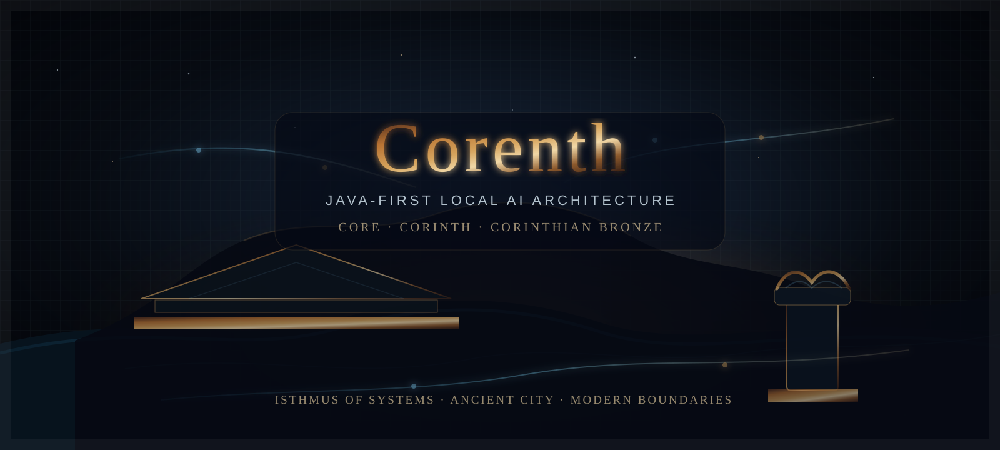

<p align="center">
  
</p>

# Corenth

Java-first local AI architecture for enterprise workstations.

Corenth is the AresStack reference architecture for bringing practical AI capability closer to the place where enterprise work already happens: the secured workstation, the existing user boundary and the systems people already use.

It starts from a tested observation:

> Useful enterprise AI does not always require a cloud-first architecture, a new platform team or a heavyweight runtime stack.

The first useful step can be smaller and more grounded: connect existing resources, respect existing permissions, index what is allowed, run lightweight local AI tasks where possible, and only cross stronger boundaries when there is a clear reason.

Corenth is not a product promise. It is a modular architecture and research scaffold for Java-first local AI integration.

## Documents

1. [Corenth README](README.md) — the short, vision-oriented project overview.
2. [Technical Thesis](docs/technical-thesis.md) — why Java-first local AI on workstations is a practical research path.
3. [Architecture Notes](docs/architecture-notes.md) — modules, boundaries, data flow and open questions.

## Architecture

```text
com.aresstack.corenth
│
├── adyton
│   └── Security vault boundary for credentials, keys and delegated access.
│
├── astu
│   ├── propylaea
│   │   └── Semantic source-code parsing and language abstraction.
│   │
│   └── acropolis
│       └── chalcotheca
│           ├── tamias
│           ├── anagraphai
│           └── pinakes
│
└── proasteion
    ├── exedra
    ├── katagogion
    └── emporion
        ├── holkas
        └── deigma
```

## Dependency direction

Corenth follows a ports-and-adapters direction:

```text
proasteion  ->  astu  ->  adyton abstractions
```

The inner city must not depend on the outer ring. UI, plugins and external system connectors belong outside the core. The core should only know stable internal concepts such as virtual resources, bookmarks, parsed structures, policies and indexes.

## Gradle structure

Each architectural unit is represented as a Gradle subproject. Module names intentionally keep the Greek terminology because the architecture uses the city metaphor as a boundary model, not as decoration.

Run from the repository root:

```bash
gradle projects
```
